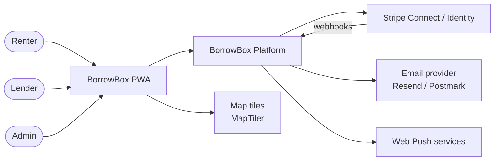
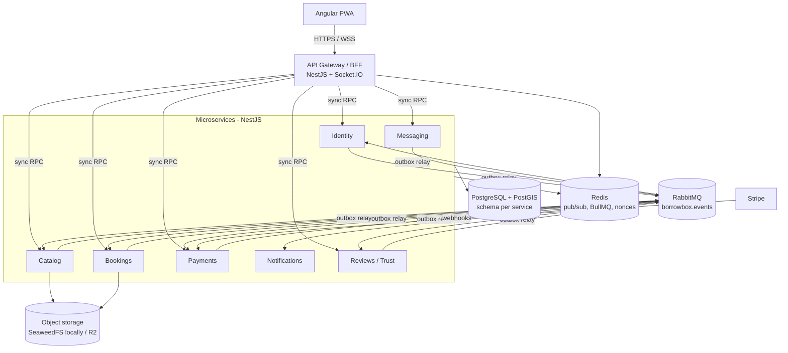
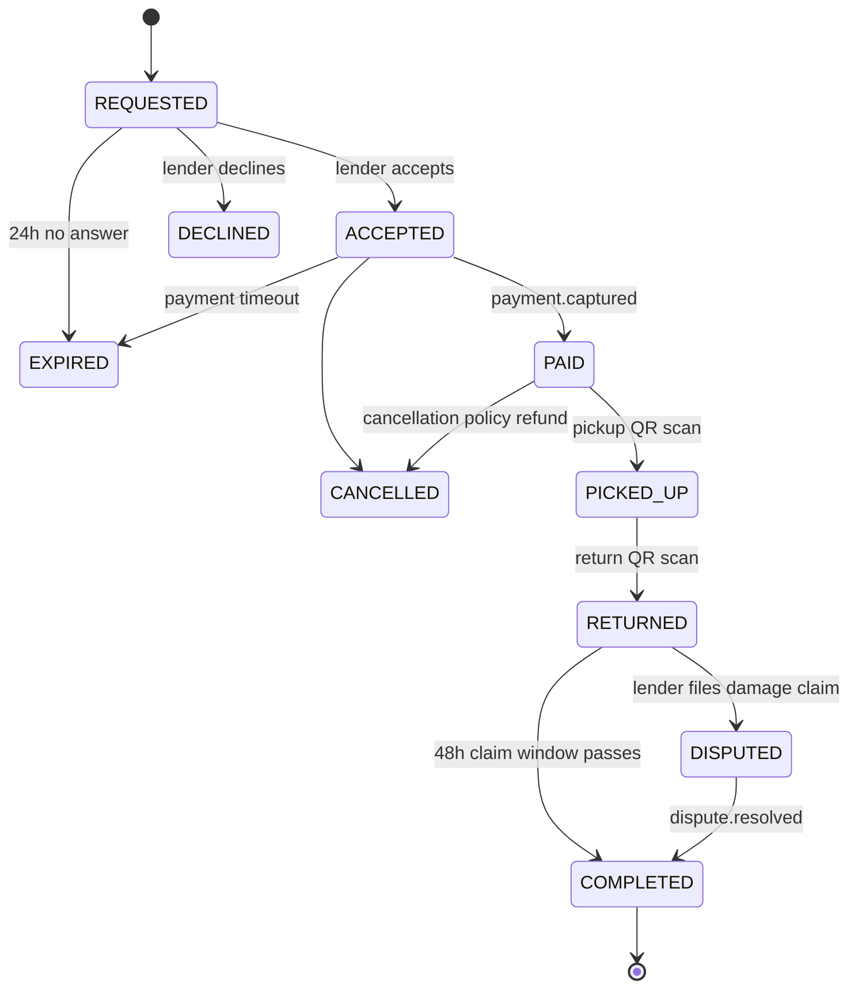
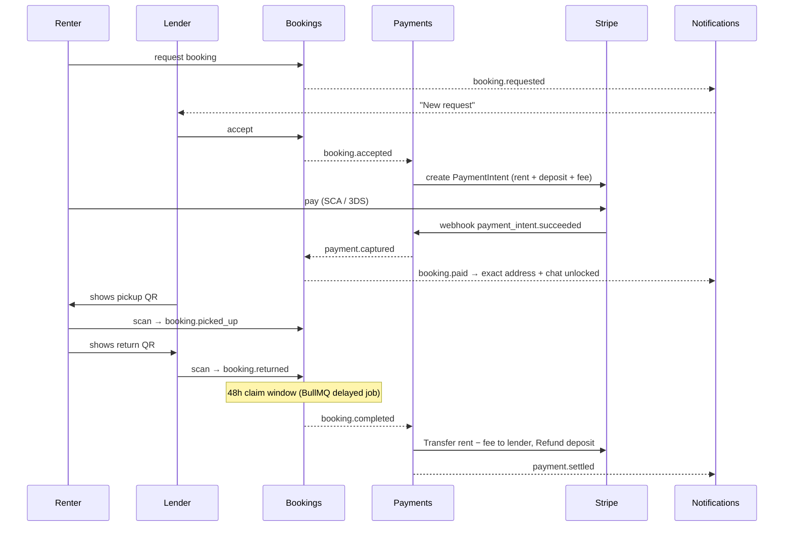

# BorrowBox – System Architecture

This document describes the target architecture of BorrowBox. Decisions with meaningful trade-offs are recorded as ADRs in [`adr/`](adr).

**Design constraints**
- Built by a **single developer**, and meant as a portfolio/learning project that could grow into a real product.
- Launch market is **Greece / EU**, so GDPR, PSD2/SCA and DAC7 apply.
- Microservices and event-driven design are deliberate choices. Operational cost is kept low with one monorepo, one Postgres instance and one `docker compose up`.

---

## 1. System context



## 2. Containers



### Communication rules
- **Client → system:** always through the gateway (REST + Socket.IO).
- **Gateway → service:** synchronous request/response over the NestJS TCP transport ([ADR-0005](adr/0005-gateway-service-transport-tcp.md)), used only for queries and user-initiated commands.
- **Service → service:** asynchronous **events** over RabbitMQ, on the topic exchange `borrowbox.events` with routing keys such as `booking.accepted.v1`. Services never call each other synchronously during a business flow.
- **Data:** each service owns one Postgres schema with its own DB role. Cross-schema reads are forbidden. When a service needs another service's data, it keeps a local read model built from events (for example, Bookings stores item title, lender id and deposit from `item.*` events).

## 3. Services

| Service | Owns | Publishes | Consumes |
|---|---|---|---|
| **Gateway** | nothing (stateless) | – | Redis pub/sub (fan-out to sockets) |
| **Identity** | users, credentials, refresh tokens, verification status | `user.registered`, `user.profile_updated`, `user.verified`, `user.deletion_requested` | `payment.account_ready` |
| **Catalog** | items, categories, photos, location | `item.created`, `item.updated`, `item.deleted` | `user.deletion_requested`, `review.created` (item rating) |
| **Bookings** | bookings, availability, handoffs, condition photos | `booking.requested`, `.accepted`, `.paid`, `.declined`, `.expired`, `.cancelled`, `.picked_up`, `.returned`, `.completed`, `.disputed` | `item.*`, `payment.captured`, `payment.failed`, `user.deletion_requested` |
| **Payments** | Stripe accounts, payments, transfers, refunds, `stripe_events` | `payment.account_ready`, `payment.captured`, `payment.failed`, `payment.settled` | `booking.accepted`, `.cancelled`, `.completed`, `.disputed`, `dispute.resolved` |
| **Messaging** | conversations, messages | `message.sent` | `payment.captured` (unlock chat), `user.deletion_requested` |
| **Notifications** | preferences, push subscriptions, in-app inbox | – | nearly every event above |
| **Reviews / Trust** | reviews, trust scores | `review.created` | `booking.completed`, `user.verified`, `booking.disputed` |

**Media** is a shared library, not a service. It issues presigned upload URLs into a private uploads bucket, and runs a BullMQ worker (inside the owning service) that strips all metadata with `sharp` and writes resized versions to a separate public-read bucket. Only processed photos are served. Stripping EXIF matters because photo GPS data would leak home locations. See [ADR-0009](adr/0009-photo-pipeline.md).

### Gateway
- REST under `/api`, calling services through typed clients (e.g. `IdentityClient`) over NestJS TCP ([ADR-0005](adr/0005-gateway-service-transport-tcp.md)). It forwards the caller's access token and an `X-Request-Id` correlation id with every call.
- **Service clients** all extend one `ServiceClient` base:
  - Each service's error codes map to HTTP statuses through a table typed against its contract, so an unmapped code is a compile error. A code that still slips through at runtime becomes `500 INTERNAL` and is logged. So does a call the service has no handler for (e.g. the gateway and the service deployed out of step).
  - No answer (timeout or connection failure) becomes `503 SERVICE_UNAVAILABLE` with a generic message; the service's name only appears in logs.
  - Calls wait `RPC_TIMEOUT_MS` (5 s) by default. Calls that are slow by nature get a longer timeout in code, which must exceed everything the service itself waits for (e.g. Google sign-in: 35 s, derived in `libs/contracts` from Identity's 10 s per Google request × up to three requests, plus a margin).
  - No automatic retries: a command may already have run.
- Phase 1 endpoints:
  - `POST /api/auth/register`, `/login`, `/refresh`, `/logout`
  - `GET /api/auth/google` and `/google/callback`
  - `GET` / `PATCH` / `DELETE /api/me`, `GET /api/me/export`
  - `GET /api/health`
- **Cookies:**
  - The refresh token is set only as `bb_refresh` (httpOnly, Secure, SameSite=Strict, `Path=/api/auth`) and never appears in a response body.
  - Google sign-in keeps its state, nonce and PKCE verifier in a signed, 10-minute `bb_oauth` cookie. It is SameSite=Lax because Google's redirect back is a cross-site navigation.
- **Security:**
  - Helmet, a CORS allow-list, a 100 kB body limit and `class-validator` DTOs.
  - Redis-backed rate limits per IP: 10/min for login, register and Google, 30/min for refresh, 120/min otherwise.
  - While Redis is unreachable, each gateway instance counts in memory instead, so the limits stay in force and the API keeps answering. It switches back to Redis by itself once Redis recovers.
  - Every error has the shape `{ statusCode, code, message }` and never echoes the request body.
- **OpenAPI:** `apps/gateway/openapi.json` is committed and regenerated with `nx run gateway:openapi`. A test fails if it drifts from the code. The PWA's API client is generated from it with `nx run web:api-client`.

### Identity
- **Passwords:**
  - Email + password: 8–64 characters with at least one letter and one digit. The rule is shared in `libs/contracts`, so the PWA, the gateway and Identity all check the same thing.
  - Hashed with argon2id at m=19 MiB, t=2, p=1 (the OWASP minimum), and rehashed on login if the parameters change.
  - Login failures take the same work and return the same error whatever the cause.
- **Access token:**
  - A JWT signed with Ed25519 (`EdDSA`), valid for 15 minutes, carrying `iss`, `aud`, `sub`, `jti`, `sid` and a `kid` header.
  - `sid` is the sign-in session (the refresh-token family).
  - Identity alone holds the private key; the gateway and services verify with the public key (`libs/auth`).
- **Refresh token:**
  - An opaque 256-bit value, stored only as a SHA-256 hash.
  - Each use rotates it within its family, and the family expires 30 days after sign-in; rotation never extends it.
  - Presenting a rotated or revoked token revokes the whole family (reuse detection).
- **Google sign-in (OIDC):**
  - Authorization code + PKCE + nonce, exchanged by Identity (`openid-client`). Accounts are matched on Google's `sub`, never on the email alone.
  - A verified Google email **auto-links** to an existing account with that email.
  - If that account's email was never verified, Google's proof is treated as the first real proof of ownership: the password is cleared and every session revoked. This defeats account pre-hijacking.
  - An email already linked to a different Google account is refused.
  - Unverified Google emails are rejected.
- Lender ID verification through **Stripe Identity**, required before listing items above a deposit threshold.
- **GDPR:**
  - `GET /me/export` returns everything Identity holds, without hashes or tokens.
  - `DELETE /me` requires re-authentication: the password, or for accounts without one, a sign-in less than 5 minutes old, on a session that is still live.
  - In one transaction it anonymises the user row, deletes OAuth identities and refresh tokens, redacts the stored `user.registered` outbox payload, and emits `user.deletion_requested`.
  - Every other service anonymises or deletes its own data. Financial records are kept as long as the law requires.

### Catalog
- `items.location` (private) and `items.location_public` are `geography(Point, 4326)`. Search uses `ST_DWithin(location_public, :point, :radius)` with a GiST index, combined with a Greek + English `tsvector` full-text index and category/price filters.
- **Location privacy** ([ADR-0004](adr/0004-location-fuzzing.md), [ADR-0007](adr/0007-location-privacy-search.md)):
  - `location_public` is the exact point moved by one random offset (150–300 m, random direction), stored per item. A pin moved by less than 300 m keeps the same offset.
  - A lender's items in one place (exact points within 300 m) share one offset, so averaging their public points reveals nothing ([ADR-0011](adr/0011-one-offset-per-place.md)).
  - Public responses and **all searches** use only `location_public`. The search radius is one of 1, 2, 5, 10, 25 or 50 km, and distances are shown as bands.
  - The exact point is visible to its owner, and later to a renter with a `PAID` booking until it completes.
- **Setting the location:** lenders drop a pin on the map or use their device location; no address is geocoded ([ADR-0008](adr/0008-maps-pin-drop.md)).
- **Pricing:** a rate card per item: any of hourly, daily, weekly and monthly rates (each €0.10–€1,000), or free, plus a separate deposit. Bookings computes what a booking costs ([ADR-0010](adr/0010-flexible-pricing.md)).
- **Item lifecycle:** `DRAFT` → `ACTIVE` (publishing needs a location and a processed photo) ⇄ `PAUSED`; any of them → `DELETED`, a tombstone without location or description. `item.created` / `item.updated` carry a snapshot without location or description; `item.updated` is only sent when the snapshot changes.
- **Commands are safe to repeat:** the client picks a new item's id (a UUID), so a retried create returns the same item; repeating a publish, pause, unpause or delete that already took effect succeeds without a second event.
- **Limits:** a lender may have 10 items at once, drafts included (`ITEM_FREE_LIMIT`). Creates and the account's erasure share a per-lender lock, so parallel creates can't exceed the limit and an item can't slip past an erasure.
- **Deleted accounts:** access tokens stay valid for up to 15 minutes, so once Catalog has processed `user.deletion_requested`, it refuses that account's write commands.

### Bookings
- Double-booking is prevented at the DB level:
  ```sql
  EXCLUDE USING gist (item_id WITH =, period WITH &&)
  WHERE (status IN ('ACCEPTED','PAID','PICKED_UP'))
  ```
- Owns the booking state machine (§4) and the QR handoff protocol (§5).
- Timeouts (acceptance expiry, payment expiry, claim window) are BullMQ delayed jobs, and each one re-checks the state before acting.

### Payments
See §6.

### Messaging
- One conversation per booking, unlocked once payment succeeds. Before that, fixed quick questions are allowed, which prevents taking deals off-platform before trust exists.
- Messages are persisted in Postgres and published to Redis. The gateway pushes them to connected sockets, and Notifications sends a push or email if the recipient is offline.

## 4. Booking lifecycle



### Happy-path saga



### Reliability patterns
- **Transactional outbox:** every state change and its event are written in one DB transaction to `<schema>.outbox`. A relay (polling or `LISTEN/NOTIFY`) publishes to RabbitMQ and marks rows as sent. This gives at-least-once delivery.
- **Idempotent consumers:** each consumer records `event_id` in `<schema>.processed_events` in the same transaction as its side effect.
- **Retention:** published outbox rows and `processed_events` entries are deleted after 7 days (the relay prunes the outbox hourly). Old envelopes can hold personal data, and redeliveries arrive within minutes.
- **Retries and DLQ:** each queue has a retry queue with TTL-based backoff (3 attempts) and a dead-letter queue, surfaced in Grafana.
- **Event envelope:** `{ eventId, type, version, occurredAt, correlationId, causationId, payload }`, with types defined in `libs/contracts`.

## 5. QR handoff protocol

1. The showing party opens the handoff screen: the lender at pickup, the renter at return.
2. The client polls `GET /bookings/:id/handoff-token?phase=pickup` every 30 s. Bookings returns a compact signed token (Ed25519): `{ b: bookingId, ph: "pickup", n: nonce, exp: now+45s }`.
3. The scanning party scans it with `BarcodeDetector`, falling back to `@zxing/browser`, and sends `POST /bookings/:id/handoff { token }`.
4. Bookings checks the signature, `exp`, phase against current state, that the scanner is the counterparty, and that the nonce is unused (`SET NX` in Redis with a TTL). It then transitions state and emits the event.
5. Both parties upload 1–3 **condition photos**, which are stored with server timestamps as dispute evidence.
6. **Fallback:** a 6-digit code derived from the same token, for when the camera fails.

This proves both people were physically present with the item, so neither side can mark a handoff alone.

## 6. Payments (Stripe Connect, EU)

See [ADR-0003](adr/0003-stripe-separate-charges-transfers.md).

- **Lenders** onboard as **Express connected accounts**. Stripe handles KYC, payouts to IBAN, SCA and DAC7 data collection. `account.updated` with `charges_enabled` triggers `payment.account_ready`.
- **Checkout:** one PaymentIntent on the platform account for `rent + deposit + service fee`, with `transfer_group = booking_<id>`.
- **Settlement** on `booking.completed`: `Transfer(rent − platform commission)` to the lender, then `Refund(deposit)` to the renter.
- **Damage claim:** an admin decides the amount. Payments transfers that part of the deposit to the lender and refunds the rest.
- **Cancellation policy:** full refund more than 24 h before the start, rent minus 50% after that (configurable).
- **Webhooks:** raw body signature verification, stored in `payments.stripe_events` (unique on the Stripe event id) and processed asynchronously.
- **Why not authorization holds:** card authorizations expire after about 7 days and not all EU cards support extended holds. Charging the deposit and then refunding it works for any rental length, and the UX must say so clearly.
- ⚠️ **Before a real launch:** confirm with Stripe or legal counsel that the flow of funds is covered under Stripe's licence (EU PSD2), and set up insurance or damage-policy terms.

## 7. Frontend (Angular PWA)

- **Structure:** standalone components, lazy-loaded feature routes, NgRx SignalStore per feature, and a typed API client generated from the gateway's OpenAPI spec.
- **Layout:** signed-in pages share a lazy-loaded app shell: a sidebar with the app's navigation on desktop, a ☰ drawer on phones. Features plug into its menu (`core/layout/nav-items.ts`); ones from later phases show as "Soon" until built.
- **Session handling:**
  - The access token lives in memory only (`AuthStore`), never in web storage. The refresh token is the httpOnly cookie, so page loads restore the session with `POST /api/auth/refresh`.
  - Refresh is single-flight: one per tab, serialised across tabs with a Web Lock, with tabs sharing sign-ins and sign-outs over `BroadcastChannel`. Refresh tokens are single-use, so two tabs refreshing at once would otherwise look like reuse.
  - An interceptor adds the bearer token and retries once after a refresh on `401 UNAUTHENTICATED`.
  - Google sign-in is a full-page redirect through the gateway, which returns the browser to `/auth/callback`. No token ever appears in a URL.
- **Dev:** `nx serve web` on port 4200 proxies `/api` to the gateway on 3000, so cookies stay same-origin, as they are behind Caddy in production.
- **Fonts and icons:** system fonts, and no fonts or icon fonts from Google's CDN, which would share visitors' IPs with Google (a GDPR issue).
- **Features:** `auth`, `explore` (map + list), `item-detail`, `listing-wizard`, `bookings` (renter/lender tabs), `handoff` (show/scan QR, condition photos), `chat`, `notifications`, `profile` (verification, Stripe onboarding, payouts), `admin` (disputes).
- **Map:** MapLibre GL with MapTiler tiles, lazy-loaded. Fuzzed locations are clustered when zoomed out and drawn as circles when zoomed in, never as precise pins. Radius search, and pin-drop to set an item's location ([ADR-0008](adr/0008-maps-pin-drop.md)).
- **PWA:** `@angular/pwa` service worker, installable, offline shell, Web Push (VAPID). iOS supports push only for installed PWAs (16.4+), so email is always the fallback.
- **i18n:** Greek + English (Transloco), with EUR formatting and the `el-GR` locale.
- **UI kit:** Angular Material ([ADR-0006](adr/0006-ui-kit-angular-material.md)).

## 8. Cross-cutting concerns

| Concern | Approach |
|---|---|
| AuthN/AuthZ | The gateway verifies JWTs, and each service re-verifies with the public key (defence in depth). Resource-level checks (e.g. "is this user the booking's lender?") live in the owning service. |
| Security | Helmet, CORS allow-list, rate limiting (`@nestjs/throttler` + Redis), input validation (`class-validator`), parameterised SQL only (a lint rule rejects `${…}` in query text), EXIF stripping, signed URLs for private photos, secrets via env / Docker secrets. |
| Observability | pino JSON logs with `correlationId`, OpenTelemetry traces propagated over HTTP and AMQP headers, Prometheus metrics, and a Grafana + Loki + Tempo compose profile. |
| Testing | Jest unit tests, **Testcontainers** integration tests (Postgres, RabbitMQ, Redis), contract safety through shared `libs/contracts` types, and **Playwright** e2e for the golden path with Stripe test mode. |
| CI/CD | GitHub Actions: `nx affected -t lint test build`, Docker images to GHCR, deploy on tag. |
| Deployment | One EU VPS (e.g. Hetzner) running Docker Compose + Caddy (auto TLS). Postgres backups to R2. k3s is optional later. |
| GDPR | EU hosting, data export and deletion flows, consent for non-essential cookies, DPAs with processors (Stripe, email, hosting), retention policy. |
| Admin | Minimal admin area in the PWA for disputes, reported listings and user suspension. |

## 9. Repository layout (Nx)

```
apps/
  web/                 Angular PWA
  gateway/             NestJS API gateway / BFF
  identity/  catalog/  bookings/  payments/
  messaging/ notifications/  reviews/
libs/
  contracts/           event + DTO types (versioned)
  auth/                JWT guards, user context
  outbox/              outbox entity, relay, idempotent consumer helper
  messaging/           RabbitMQ setup, retry/DLQ topology
  media/               presigned uploads, image worker
  observability/       logger, OpenTelemetry bootstrap
  testing/             Testcontainers helpers, factories
infra/
  docker-compose.yml   postgres+postgis, rabbitmq, redis, seaweedfs (S3) + storage-init, mailpit
  docker-compose.observability.yml
  postgres/init/       schemas + roles per service
  storage/             SeaweedFS identities, bucket/CORS/expiry setup (also for R2)
docs/
  ARCHITECTURE.md
  adr/
```

Messaging and Reviews can start as modules inside Bookings and move into their own apps once the event contracts settle.

## 10. Future work
- Kafka (or an event log) for analytics and event replay.
- Insurance partner integration for high-value items.
- Capacitor wrapper for app-store presence and better push support on iOS.
- Meilisearch if Postgres full-text search stops being enough.
- Community features: neighbourhood groups, "wanted" requests.

### Side decisions (revisit once all phases are done)
- **Rate-limiting algorithm.** The Redis store counts in a fixed window that starts at a client's first request, so a client can get about 2× the limit in a burst across a window boundary. The in-memory fallback is a sliding-window log, so it's slightly stricter. That's fine for brute-force protection today. Decide whether to switch Redis to a sliding window or a token bucket (a custom Lua script) for smoother limits.
- **Retries and a circuit breaker for gateway → service calls (revisit in Phase 7).** Today a failed call is not retried. Options: retry read-only calls once on a connection error, and/or a circuit breaker that fails fast while a service is down. Commands must not be retried blindly (they may already have run).
- **Offsets derived from a secret (revisit in Phase 7).** A lender who moves a pin 300 m or more away and back draws a new offset each time, so someone recording one item's public point over weeks could average several offsets for the same home ([ADR-0011](adr/0011-one-offset-per-place.md)). The robust fix derives the offset from a server secret, the lender and a coarse area, so a place always gets the same offset.
- **CDN caching of public photos (decide at deployment, Phase 7).** If a CDN caches the public photo bucket, a deleted photo stays reachable at its old URL until its cache entry expires, which delays GDPR erasure. Choose a short cache lifetime, or purge the CDN on delete. Photo keys are random and never reused, so caching can't show the wrong photo.
